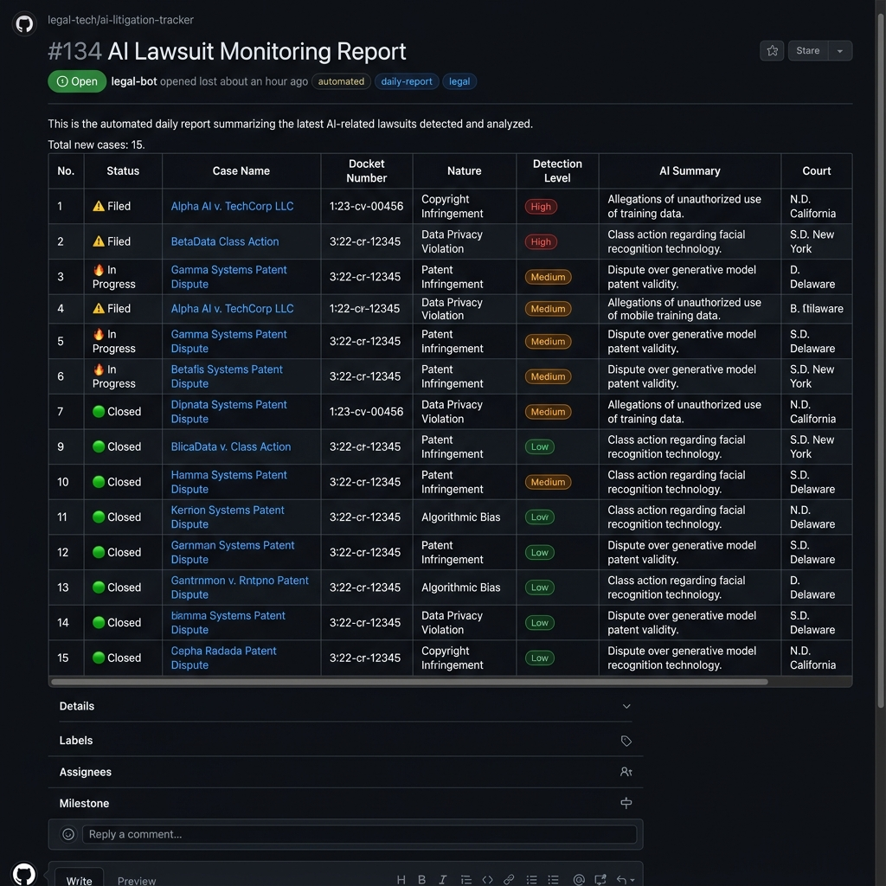
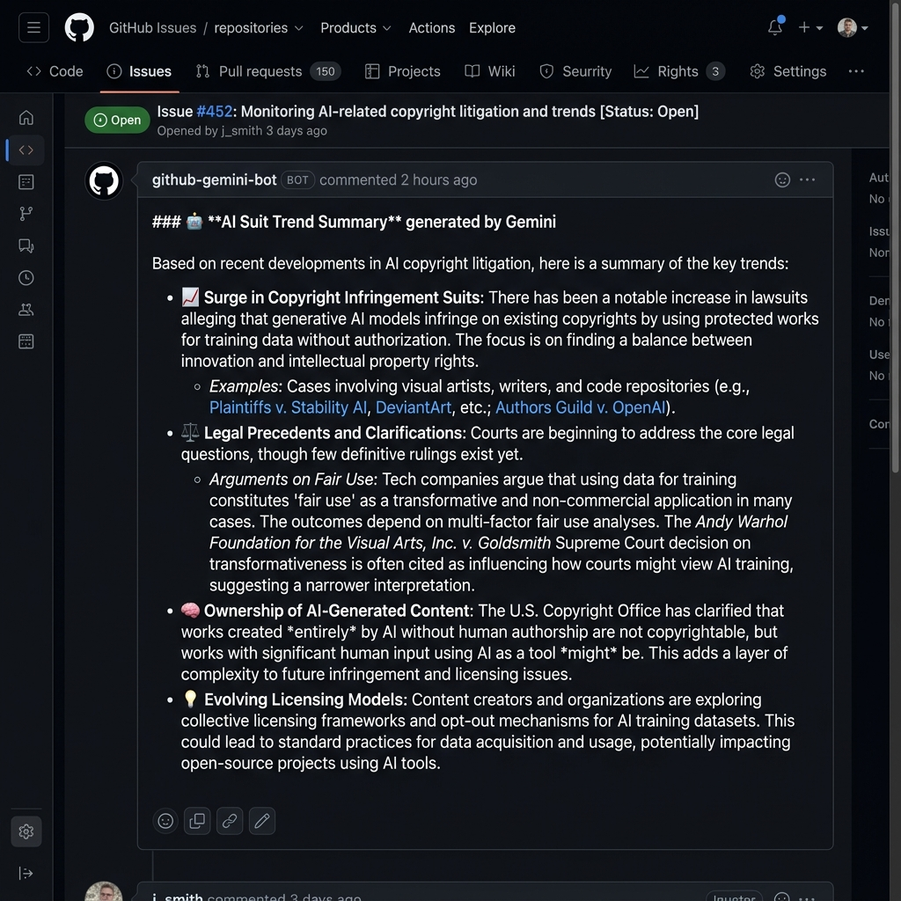
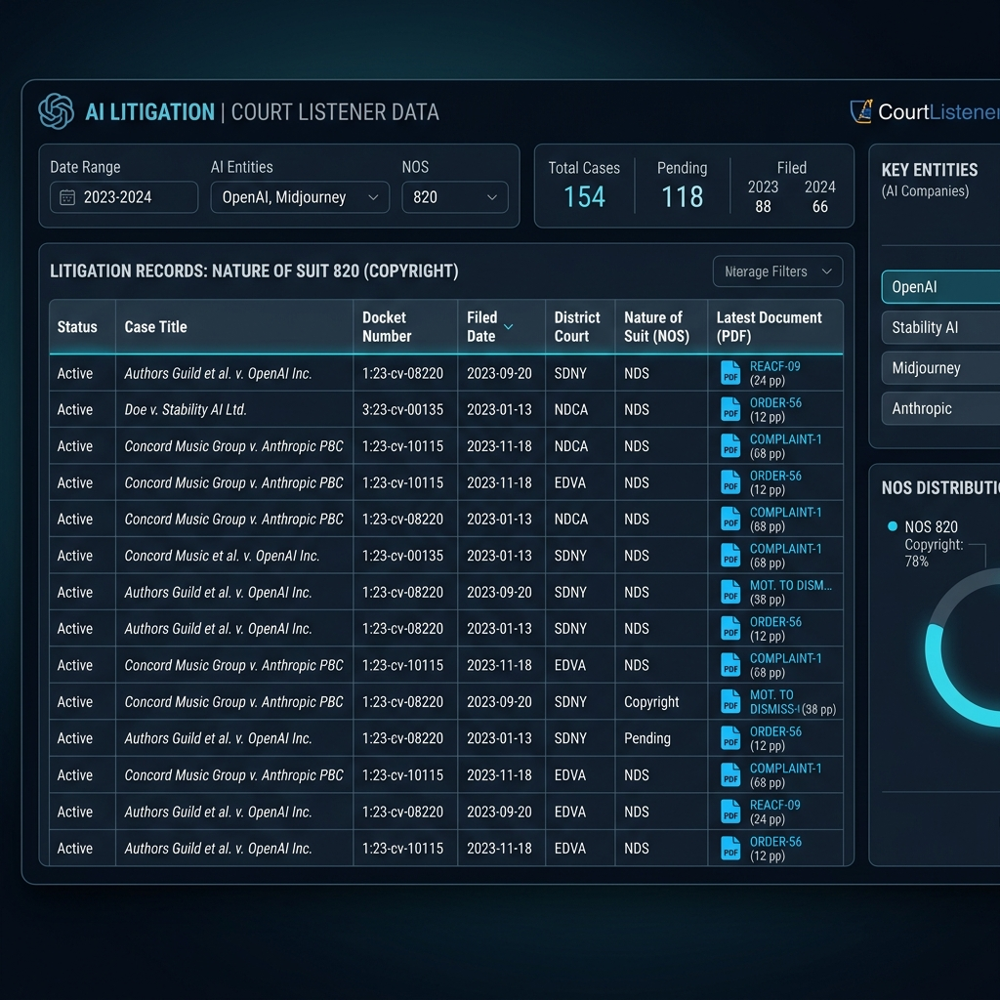

# AI Lawsuit Radar (CourtListener/RECAP & News Extractor)

AI 모델 학습을 위한 데이터 무단 사용 및 관련 저작권 소송을 추적하고 분석하는 자동화 도구입니다. 최근 설정된 기간(기본 3일) 내의 소송 정보를 **CourtListener(RECAP Archive)**와 **뉴스(RSS)**에서 수집하여 GitHub Issue와 Slack으로 통합 리포트를 제공하며, 인텔리전트한 중복 제거 로직을 통해 최신 업데이트만 깔끔하게 확인할 수 있습니다.

## 🖼️ 미리보기 (Preview)

| GitHub Issue 리포트 | Slack 모바일 알림 |
|:---:|:---:|
|  |  |

| Gemini AI 동향 요약 | CourtListener 데이터 수집 |
|:---:|:---:|
|  |  |

## ✨ 핵심 기능

### 1. 🔍 다각도 소송 추적
- **CourtListener(RECAP) 정밀 탐색**: "PACER Document" 중 Complaint, Petition 등 소장 위주로 우선 수집합니다.
- **뉴스 기반 보강**: RSS 뉴스를 통해 최신 소송 소식을 수집하고, 관련 도켓(Docket) 정보를 역추적하여 상세 정보를 확장합니다.
- **지능형 쿼리**: 정밀한 키워드 조합(AI training, LLM, copyright, DMCA 등)을 사용하여 관련성 높은 항목만 필터링합니다.

### 2. ⚖️ 정밀 데이터 분석 & 감지 레벨 분석
- **비인가 데이터 학습 소송 감지 레벨(0~100)**: 소장의 내용을 분석하여 저작권 직접 언급, 무단 수집, 학습 직접 언급, 상업적 이용 여부 등을 점수화하고 시각화(🟢, 🟡, ⚠️, 🔥)합니다.
- **주요 섹션 추출**: 소장의 초반 텍스트에서 '소송 이유', 'AI 학습 관련 핵심 주장', '법적 근거'를 자동으로 추출하여 요약합니다.
- **통계 자동 산출**: **Nature of Suit (NOS)** 통계와 함께 각 코드별 의미 안내표를 제공하여 전반적인 법적 트렌드 분석을 돕습니다.

### 3. 🤖 스마트 리포팅 & 중복 제거 (Dedup)
- **일자별 통합 이슈**: 매일 하나의 GitHub Issue를 생성하고, 주기적 실행 결과를 댓글로 누적합니다.
- **강력한 중복 제거 시스템**:
    *   **이슈 내 중복 제거**: 현재 이슈 내에서 이미 보고된 내용을 제외합니다.
    *   **이슈 간 중복 제거 (Cross-Day Dedup)**: **날짜가 바뀌어 새 이슈가 생성되어도 전날 마지막 리포트와 중복되는 내용(뉴스 제목/소송 도켓번호 기준)은 자동으로 Skip** 처리하여 중복 열람의 피로도를 해소합니다.
    *   **의미론적 중복 제거 (Semantic Dedup)**: 단순히 제목이 같은 것을 넘어, **BM25 알고리즘** 및 **Gemini Embedding(text-embedding-004)** 기술을 활용하여 문맥상 동일한 뉴스를 다루는 기사들을 감지하고 자동으로 필터링합니다. (API 비용 절감을 위한 1.5차 BM25 필터링 지원)
- **가독성 최적화 (Folding)**: 리빙 섹션(동향 요약, NOS 통계, Top 3 소송 등)은 기본적으로 접음(fold) 처리되어 리포트가 길어져도 핵심을 빠르게 파악할 수 있습니다.
- **통합 정리 리포트**: 이슈 종료(Close) 직전, 당일에 수집된 모든 리포트 내용을 취합하여 **"당일 소송건들 통합 정리 자료"**를 최종 발행합니다.

### 4. 📢 실시간 알림 시스템
- **Slack 알람**: 중복 제거 요약, 수집 현황, 최신 RECAP 문서 링크를 포함한 요약을 실시간으로 발송합니다.
- **자동 이슈 관리**: 이전 날짜의 이슈를 자동으로 닫고 최신 이슈 링크를 연결하여 히스토리를 체계적으로 관리합니다.
 
### 5. 🤖 Gemini 인텔리전트 요약 & 동향 분석
- **AI 인텔리전트 요약**: 수집된 최신 소송 및 뉴스 데이터를 Gemini 모델이 실시간 분석하여 "AI Overview" 스타일의 핵심 트렌드 리포트를 발행합니다.
- **스마트 기능 안내 (Skip Notice)**: 기능이 비활성화된 경우, 사용자에게 활성화 방법을 안내하는 디자인틱한 안내 메시지를 자동으로 출력합니다.
 
### 6. 📝 계층형 댓글 구조 (Output Structure)
- **이슈 본문**: 데이터 수집 출처 및 법률 코드 안내 등 기본 가이드 제공
- **첫 번째 댓글**: Gemini 기반 "설정된 기간(기본 3일) 동안의 소송센싱 주요 동향 현황" 요약 리포트
- **두 번째 댓글**: 실행 시각, 중복 제거 요약, 뉴스/소송 상세 테이블이 포함된 메인 리포트

## 🛠️ 설정 가이드

### 1. 기본 서비스 설정 (Non-LLM)
주로 인프라 및 기본 수집/알림에 필요한 설정입니다.

| Name | Type | Value (Default) | Description |
|---|---|---|---|
| `SLACK_WEBHOOK_URL` | **Secret** | (필수) | Slack Incoming Webhook URL |
| `GITHUB_OWNER` | **Secret** | (필수) | Repository 소유자 (예: `aigovsensing`) |
| `GITHUB_REPO` | **Secret** | (필수) | Repository 이름 (예: `ai-suit-tracker-v02`) |
| `GITHUB_TOKEN` | **Secret** | (필수) | GitHub API 토큰 (`secrets.GITHUB_TOKEN` 사용 가능) |
| `COURTLISTENER_TOKEN` | **Variable** | (선택 권장) | CourtListener API v4 인증 토큰 |
| `LOOKBACK_DAYS` | **Variable** | `3` | 며칠 전까지의 정보를 수집할지 설정 |
| `ISSUE_TITLE_BASE` | **Variable** | `AI 소송 Radar` | 생성될 이슈의 기본 제목 |
| `PREVIOUS_ITEM_DEDUP_DAYS` | **Variable** | (공백) | **설정 시 이전 날짜 이슈와 중복 체크 수행.** `3` 설정 시 설정된 일수(예: 3일) 내의 이슈 댓글들을 확인하여 중복된 소송/뉴스는 리포트에서 제외합니다. |
| `DEBUG` | **Variable** | `0` | 1 설정 시 상세 디버그 로그 출력 |
| `ENABLE_EMAIL_SENDER` | **Variable** | `0` | **1 설정 시 이메일 전송 기능 활성화.** 0 설정(디폴트) 시 비활성화됩니다. |


### 2. 고도화된 중복 제거 및 AI 지능형 기능 설정 (BM25 / Gemini)
BM25 알고리즘을 활용한 로컬 텍스트 분석 및 Gemini API를 연동하여 리포트의 가독성과 분석 품질을 극대화하는 설정입니다. (Gemini 관련 옵션 활성화 시 API 호출 비용 발생)

| Name | Type | Value (Default) | Description |
|---|---|---|---|
| `GEMINI_API_KEY` | **Secret** | (선택) | Google AI Studio API 키 (**실행당 평균 1~3회 호출**) |
| `GEMINI_AISUIT_TREND_DAYS` | **Variable** | (공백) | **설정 시 Gemini 요약 기능 활성화.** 분석할 데이터의 기간(예: `3`)을 입력하면 해당 기간의 동향을 Gemini가 분석하여 발행합니다. (실행당 1회 호출) |
| `GEMINI_DAILY_REPORT_IMAGEGEN` | **Variable** | `0` | **설정 시 당일 요약 리포트에 지브리 스타일 이미지 생성.** (1: 활성화, 0: 비활성화. 실행당 1회 Imagen 3 호출) |
| `BM25_SEMANTIC_DEDUP` | **Variable** | `0` | **설정 시 BM25 알고리즘 기반 텍스트 유사도 중복 제거 활성화.** (1: 활성화, 0: 비활성화, API 비용 없이 로컬에서 빠른 유사도 필터링 수행) |
| `BM25_DEDUP_THRESHOLD` | **Variable** | `3.0` | BM25 중복 판정 점수 임계값 (숫자가 높을수록 엄격하게 일치해야 중복 처리) |
| `GEMINI_SEMANTIC_DEDUP` | **Variable** | `0` | **설정 시 의미론적 중복 제거 활성화.** (1: 활성화, 0: 비활성화, 실행당 약 2회 Embedding API 호출) |
| `SEMANTIC_DEDUP_THRESHOLD` | **Variable** | `0.85` | 의미론적 중복 판정 임계값 (0.0~1.0, 높을수록 엄격) |
| `GEMINI_MODEL` | **Variable** | `gemini-3-flash-preview` | 사용할 Gemini 모델명 |

> 💡 **하이브리드(Hybrid) 2단계 필터링 팁 (추천)**
> `BM25_SEMANTIC_DEDUP=1`과 `GEMINI_SEMANTIC_DEDUP=1`을 모두 활성화하면 가장 스마트하고 경제적인 중복 제거가 가능합니다.
> 1. **1단계 (BM25 로컬 필터링):** 로컬 알고리즘이 단어가 많이 겹치는 중복 기사들을 API 호출 없이 빠르게 걸러냅니다.
> 2. **2단계 (Gemini 의미론적 필터링):** 1단계 필터를 통과한 기사들만 Gemini API로 전송하여 문맥이 동일한 기사를 심층 필터링합니다. (예: "NYT sues OpenAI" vs "New York Times takes legal action against Sam Altman's company")
> 
> 이 방식을 통해 **Gemini API 호출량(비용 및 Rate Limit)을 획기적으로 줄이면서도 최고의 필터링 품질을 유지**할 수 있습니다.

### 3. Google AI Studio 무료 API 지원 정보 (2026년 기준)

2026년 현재 **Google AI Studio**의 정책에 따르면, **Imagen (독립형 이미지 생성 모델) API는 유료 플랜(Paid Plan)에서만 제공**되는 것으로 확인됩니다. 무료 티어(Free Tier)에서는 텍스트 생성 및 분석은 가능하지만, API를 통한 이미지 생성은 제한되어 있습니다.

#### 1) 이미지 생성(Imagen) 사용 권한
* **유료 플랜 필요:** Imagen 4 및 독립형 Imagen 모델을 API로 호출하려면 유료 계정 업그레이드가 필요합니다.
* **대안:** 무료 이미지 생성이 필요한 경우, **Hugging Face Inference API** (Stable Diffusion, FLUX 등)를 활용하는 것을 권장합니다.

#### 2) 텍스트 생성(Gemini) 사용 권한
* **지원 모델:** **Gemini 3 Flash-Lite** 및 **Flash** 등
* **특이 사항:** 2026년 정책 업데이트로 **Gemini Pro** 이상급 모델은 유료/선불 계정 위주로 제공되며, **Flash 모델**은 무료 티어에서 여전히 높은 성능과 넉넉한 쿼터를 제공합니다.

#### 3) API 무료 티어 및 할당량 (Quota)
| 구분 | Gemini 3 Flash / Flash-Lite | Imagen 4 (API) |
| --- | --- | --- |
| **분당 요청수 (RPM)** | 15 RPM | 유료 플랜 전용 |
| **일일 요청수 (RPD)** | 1,500 RPD | 유료 플랜 전용 |
| **비용** | $0 (무료) | 유료 (Pay-as-you-go) |

> **참고:** 무료 사용 시 "사용자의 데이터가 모델 학습에 사용될 수 있다"는 점에 유의하세요. 상세 정보는 [공식 가격 정책](https://ai.google.dev/pricing)을 확인하세요.

## 📩 이메일 전송 (Gmail SMTP 연동)

본 프로젝트는 중개 서비스(FormSubmit.co) 없이 직접 **Gmail SMTP(Simple Mail Transfer Protocol)** 서버를 통해 조간뉴스 및 석간뉴스 리포트를 이메일로 안전하게 전송합니다.

### 1️⃣ Secrets 등록 (Settings → Secrets and variables → Actions)
보안이 필요한 메일 비밀번호는 깃허브 **Secrets**에 등록하여 관리합니다.

#### 🔒 Repository Secrets (보안 정보)
| Key | 필수여부 | 설명 |
| --- | --- | --- |
| `SMTP_PASS` | **필수** | 발송용 Gmail 계정의 **16자리 앱 비밀번호 (App Password)** |

> 💡 **Gmail 앱 비밀번호 발급 방법:**
> 1. 발송용 Gmail 계정의 **구글 계정 관리 -> 보안** 페이지로 이동합니다.
> 2. **2단계 인증**을 활성화합니다.
> 3. 검색창에 **'앱 비밀번호'**를 검색하거나 해당 메뉴로 진입합니다.
> 4. 앱 이름(예: `GitHub Actions`)을 입력하고 **만들기**를 눌러 생성된 **16자리 비밀번호**를 복사하여 깃허브 Secrets에 등록합니다.

---

### 2️⃣ 설정 파일 관리 ([email.json](./data/email.json))
비밀번호(`SMTP_PASS`)를 제외한 모든 SMTP 연결 정보 및 수신자 리스트는 유지보수의 용이성을 위해 레포지토리 내의 **[email.json](./data/email.json)** 파일에서 일괄 관리합니다.

```json
{
  "_comment": "수신자의 이메일 주소 정보 파일",
  "smtp_host": "smtp.gmail.com",
  "smtp_port": 587,
  "sender": "leemgs@gmail.com",
  "receivers": [
    "ai.gov.sensing@gmail.com",
    "leemgs@gmail.com"
  ]
}
```

#### ⚙️ email.json 설정 필드 설명
| Field | 필수여부 | 기본값(Default) | 설명 |
| --- | --- | --- | --- |
| `smtp_host` | 선택 | `smtp.gmail.com` | 발송에 사용할 SMTP 메일 서버 호스트 주소 |
| `smtp_port` | 선택 | `587` | 발송에 사용할 SMTP 포트 번호 |
| `sender` | **필수** | (없음) | 발송을 수행할 Gmail 계정 주소 (앱 비밀번호와 연동된 계정) |
| `receivers` | **필수** | (없음) | 리포트를 수신할 이메일 주소 목록 (배열 형식) |


## 🚀 실행 및 스케줄

### GitHub Actions (KST 최적화 스케줄)
- **업무 시간 (KST 08:00 - 20:00)**: **매 1시간마다** 정밀 실행
- **비업무 시간 (KST 22:00 - 06:00)**: **매 2시간마다** 실행
- `Actions` 탭에서 수동 실행(`workflow_dispatch`)도 가능합니다.

### 로컬 실행
1. `pip install -r requirements.txt`
2. `.env` 파일 설정 (GITHUB_OWNER, GITHUB_REPO, GITHUB_TOKEN, SLACK_WEBHOOK_URL, BM25_SEMANTIC_DEDUP=1 등)
3. `python -m src.run`

## 📊 비인가 데이터 학습 소송 감지 기준 (Detection Criteria)

| 항목 | 조건 (주요 키워드) | 점수 |
|---|---|---|
| **핵심 AI 학습 저작권 소송** | **(820/Copyright) + (Train/Training)** | **+50** |
| **저작권 직접 언급** | 820, 3820, copyright 등 | +30 |
| **무단 데이터 수집 명시** | scrape, crawl, ingest, harvest, mining, extraction, bulk, collection, robots.txt, common crawl, laion, the pile, bookcorpus, unauthorized 등 | +25 |
| **모델 학습 직접 언급** | train, training, model, llm, generative ai, genai, gpt, transformer, weight, fine-tune, diffusion, inference 등 | +20 |
| **저작권 관련/쟁점** | infringement, dmca, fair use, derivative, exclusive 등 | +10 |
| **상업적 사용** | commercial, profit, monetiz, revenue, subscription, enterprise, paid, for-profit 등 | +10 |
| **집단소송** | class action, putative class, representative 등 | +5 |
| **데이터 제공 계약/협력**| contract, licensing, agreement, partnership, 계약, 협력, 제휴 등 | -10 |

- **핵심 가점 항목**: 저작권 소송(Nature 820 등)이면서 문서 내에 모델 학습(Train/Training) 키워드가 동시에 발견될 경우 **+50점**의 추가 가점을 부여하여 최상위 리스크로 산정합니다.
- **감지 레벨 (Detection Level)**: 해당 건이 비인가 데이터 학습 소송과 얼마나 밀접한지를 표현합니다.
- **80~100 🔥**: 무단 수집 + 학습 + 상업적 사용 (Critical High)
- **60~79 ⚠️**: 모델 학습 직접 언급 및 관련 쟁점 수반 (High)
- **40~59 🟡**: 학습 데이터 관련 법적 쟁점 존재 (Medium)
- **0~39 🟢**: 간접 연관 또는 정식 계약 사례 (Low)
- **점수 보정**: 정식 계약/협력 발생 시 감지 레벨 점수를 -10점 차감하여 리스크 스코어를 하향 조정합니다. (최소 0점)

## 📝 참고 사항
- **RECAP 데이터**: PACER에 등록된 문서 중 공개(RECAP)된 문서만 실물 접근 가능합니다.
- **KST 기준**: 모든 시간 포맷과 이슈 일자 분류는 한국 표준시(Asia/Seoul)를 따릅니다.
- **GitHub Permissions**: Workflow가 이슈를 관리할 수 있도록 `contents: read`, `issues: write` 권한이 필요합니다.

## 📚 참고문헌 (References)


[1] M. A. Lemley and B. Casey, "Fair Learning," *Texas Law Review*, vol. 99, no. 4, pp. 743–785, Mar. 2021. \[Online\]. Available: [https://texaslawreview.org/fair-learning/](https://texaslawreview.org/fair-learning/) (preprint: [https://papers.ssrn.com/sol3/papers.cfm?abstract_id=3528447](https://papers.ssrn.com/sol3/papers.cfm?abstract_id=3528447))

[2] M. Sag, "Copyright Safety for Generative AI," *Houston Law Review*, vol. 61, no. 4, pp. 295–347, 2023. \[Online\]. Available: [https://houstonlawreview.org/article/92126-copyright-safety-for-generative-ai](https://houstonlawreview.org/article/92126-copyright-safety-for-generative-ai) (preprint: [https://papers.ssrn.com/sol3/papers.cfm?abstract_id=4438593](https://papers.ssrn.com/sol3/papers.cfm?abstract_id=4438593))

[3] P. Henderson *et al.*, "Foundation Models and Fair Use," arXiv preprint, arXiv:2303.15715, Mar. 2023. \[Online\]. Available: [https://arxiv.org/abs/2303.15715](https://arxiv.org/abs/2303.15715)

[4] B. L. W. Sobel, "Artificial Intelligence's Fair Use Crisis," *Columbia Journal of Law & the Arts*, vol. 41, no. 1, pp. 45–97, 2017. \[Online\]. Available: [https://journals.library.columbia.edu/index.php/lawandarts/article/view/2036](https://journals.library.columbia.edu/index.php/lawandarts/article/view/2036)

[5] N. Elkin-Koren, "Controlling the Means of Creativity: Generative AI and the Future of Copyright," *Cardozo Arts & Entertainment Law Journal*, vol. 41, no. 1, pp. 1–42, 2023. \[Online\]. Available: [https://larc.cardozo.yu.edu/aelj/](https://larc.cardozo.yu.edu/aelj/)  

[6] D. J. Gervais, "The Human Cause as the Foundation of Copyright Law," *Vanderbilt Law Review*, vol. 76, no. 4, pp. 1121–1180, May 2023. \[Online\]. Available: [https://vanderbiltlawreview.org](https://vanderbiltlawreview.org) (SSRN 선행 버전: [https://papers.ssrn.com/sol3/papers.cfm?abstract_id=3857844](https://papers.ssrn.com/sol3/papers.cfm?abstract_id=3857844))

[7] P. Samuelson, "Generative AI meets Copyright," *Science*, vol. 381, no. 6654, pp. 158–161, July 2023. \[Online\]. Available: [https://www.science.org/doi/10.1126/science.adi0656](https://www.science.org/doi/10.1126/science.adi0656)

## 📚 참고 오픈소스 (Open Source References)

본 프로젝트의 소송 센싱 및 분석 데이터 처리를 위해 다음과 같은 주요 오픈소스 라이브러리들을 활용하고 있습니다.

| 오픈소스 명칭 | 라이선스 (License) | 주요 기능 요약 | 웹주소 링크 |
|---|---|---|---|
| **google-genai** | Apache 2.0 | Google Gemini API 연동을 위한 최신 공식 Python SDK (동향 요약, 임베딩 등) | [GitHub Repo](https://github.com/googleapis/python-genai) |
| **google-generativeai** | Apache 2.0 | Google Gemini API 연동을 위한 이전 공식 SDK (레거시 지원) | [GitHub Repo](https://github.com/google-gemini/generative-ai-python) |
| **rank_bm25** | Apache 2.0 | 문서 검색 및 텍스트 유사도 검사를 위한 BM25 알고리즘 구현 | [GitHub Repo](https://github.com/dorianbrown/rank_bm25) |
| **feedparser** | BSD 2-Clause | RSS 및 Atom 피드 데이터 추출 및 파싱 | [GitHub Repo](https://github.com/kurtmckee/feedparser) |
| **beautifulsoup4** | MIT | HTML 뉴스 웹페이지 구조 분석 및 웹 스크래핑 | [Official Site](https://www.crummy.com/software/BeautifulSoup/) |
| **lxml** | BSD 3-Clause | 고성능 XML 및 HTML 문서 파싱 및 처리 | [GitHub Repo](https://github.com/lxml/lxml) |
| **pypdf** | BSD 3-Clause | 법원 소장 등 PDF 문서 텍스트 추출 및 병합 | [GitHub Repo](https://github.com/py-pdf/pypdf) |
| **requests** | Apache 2.0 | CourtListener API 및 웹페이지 호출용 HTTP 통신 라이브러리 | [GitHub Repo](https://github.com/psf/requests) |
| **python-dateutil** | Dual (BSD/Apache) | 복잡한 날짜/시간 데이터 포맷 및 시간대 변환 | [GitHub Repo](https://github.com/dateutil/dateutil) |
| **PyYAML** | MIT | YAML 설정 파일 파싱 및 가독성 높은 직렬화 | [GitHub Repo](https://github.com/yaml/pyyaml) |

---